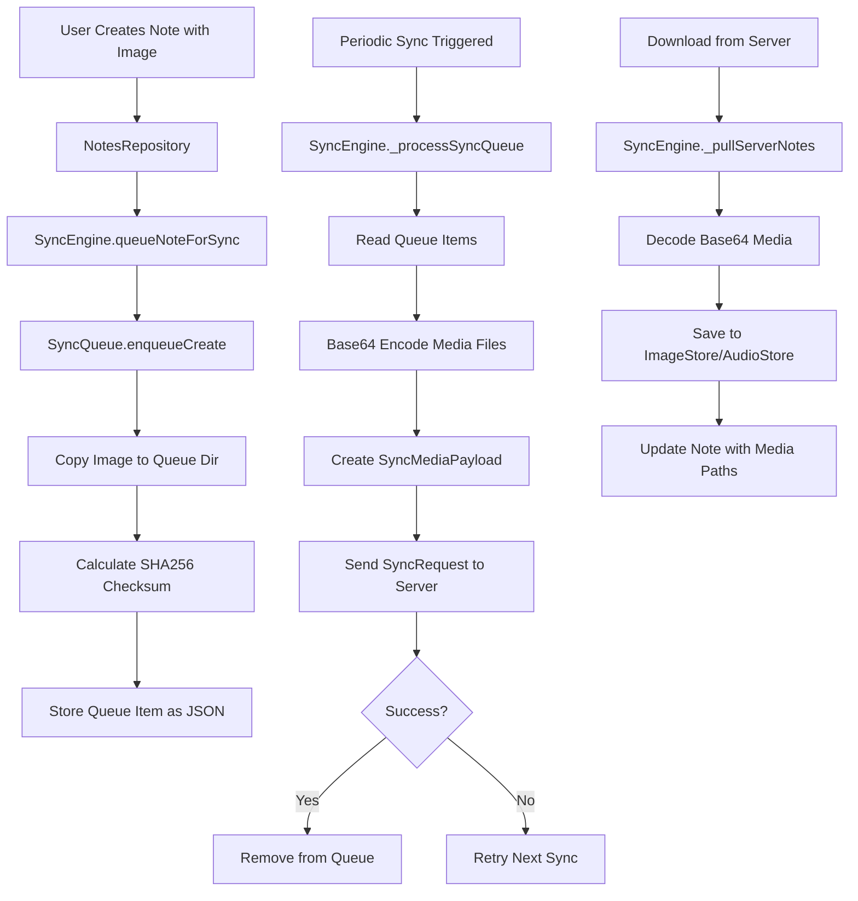

# Phase 3: Media Sync Implementation Walkthrough

## Overview
Successfully implemented media (images/audio) sync for the Android Timeline app. Media files are now base64-encoded and uploaded/downloaded as part of the sync payload, matching the iOS implementation.

## What Was Implemented

### 1. Sync Models Enhancement

Added `SyncMediaPayload` class to support media sync:

**[lib/services/notesync_client.dart](file://../lib/services/notesync_client.dart#L72-L113)**
```dart
class SyncMediaPayload {
  final String id;
  final String noteId;
  final String kind; // "image" or "audio"
  final String filename;
  final String contentType; // "image/jpeg" or "audio/m4a"
  final String checksum; // SHA256 hash
  final String dataBase64; // Base64-encoded file data
}
```

Updated `SyncOperationPayload` and `NotesyncRestoreResponse` to use typed `List<SyncMediaPayload>` instead of `List<dynamic>`.

### 2. Media Utilities Helper

**[lib/services/media_utils.dart](file://../lib/services/media_utils.dart)**

Created utility functions for:
- **SHA256 checksums** - Calculate file integrity hashes
- **Base64 encoding/decoding** - Convert binary files to/from text
- **Content-type detection** - Determine MIME types
- **Checksum validation** - Verify file integrity

### 3. SyncQueue Rewrite

**[lib/services/sync_queue.dart](file://../lib/services/sync_queue.dart)**

Completely rewrote to match iOS implementation:
- **File-based queue** instead of database-based
- **Copies media files** to queue directory for safety
- **Calculates checksums** when enqueuing media
- **Stores complete note snapshots** with media metadata
- **JSON-based storage** for queue items

Key structures:
```dart
class SyncQueuedNote { /* Note snapshot */ }
class SyncQueuedMedia { /* Media metadata + local path */ }
class SyncQueueItem { /* Complete operation with note + media */ }
```

### 4. SyncEngine Media Upload

**[lib/services/sync_engine.dart:_processSyncQueue()](file://../lib/services/sync_engine.dart#L142-L207)**

Updated to handle media upload:
1. Read queued items with media metadata
2. For each media file:
   - Read file from queue directory
   - Base64-encode file data
   - Create `SyncMediaPayload` with checksum
3. Include media payloads in `SyncRequest`
4. Upload to server in one request

### 5. SyncEngine Media Download

**[lib/services/sync_engine.dart:_pullServerNotes()](file://../lib/services/sync_engine.dart#L210-L280)**

Updated to handle media download:
1. Receive `NotesyncRestoreResponse` with media
2. For each `SyncMediaPayload`:
   - Decode base64 data to bytes
   - Save to ImageStore or AudioStore
3. Associate media filenames with notes
4. Update local notes with media paths

### 6. ImageStore & AudioStore Enhancements

Added helper methods for sync operations:

**[lib/data/image_store.dart](file://../lib/data/image_store.dart#L65-L82)**
```dart
Future<void> saveBytes(String filename, List<int> bytes)
Future<File> getFile(String filename)
```

**[lib/data/audio_store.dart](file://../lib/data/audio_store.dart#L51-L68)**
```dart
Future<void> saveBytes(String filename, List<int> bytes)
Future<File> getFile(String filename)
```

## Architecture



## How It Works

### Upload Workflow

1. **Note Creation**
   ```dart
   Note note = Note(
     text: "My vacation photo",
     imagePaths: ["abc123.jpg"],
   );
   await repository.createNote(note);
   ```

2. **Queue Enqueuing**
   ```dart
   await syncEngine.queueNoteForSync(note, 'create');
   // → SyncQueue copies abc123.jpg to queue/Media/
   // → Calculates SHA256 checksum
   // → Stores queue item as JSON
   ```

3. **Sync Upload**
   ```dart
   // During sync:
   final imageFile = File('queue/Media/xyz.jpg');
   final base64Data = await MediaUtils.encodeFileToBase64(imageFile);
   
   final mediaPayload = SyncMediaPayload(
     id: 'media-uuid',
     noteId: note.id,
     kind: 'image',
     filename: 'xyz.jpg',
     contentType: 'image/jpeg',
     checksum: 'sha256...',
     dataBase64: base64Data, // Embedded in JSON
   );
   ```

4. **Server receives JSON with embedded base64 image**

### Download Workflow

1. **Server Response**
   ```json
   {
     "notes": [...],
     "media": [
       {
         "id": "media-uuid",
         "noteId": "note-123",
         "kind": "image",
         "filename": "photo.jpg",
         "contentType": "image/jpeg",
         "checksum": "abc123...",
         "dataBase64": "/9j/4AAQSkZJRg..."
       }
     ]
   }
   ```

2. **Decode and Save**
   ```dart
   final bytes = MediaUtils.decodeBase64ToBytes(media.dataBase64);
   await imageStore.saveBytes('photo.jpg', bytes);
   ```

3. **Associate with Note**
   ```dart
   note.imagePaths = ['photo.jpg'];
   await repository.updateNote(note);
   ```

## Changes Summary

| File | Changes |
|------|---------|
| [pubspec.yaml](file://../pubspec.yaml) | Added `crypto: ^3.0.5` dependency |
| [notesync_client.dart](file://../lib/services/notesync_client.dart) | Added `SyncMediaPayload`, updated models |
| [media_utils.dart](file://../lib/services/media_utils.dart) | **NEW** - SHA256, base64, content-type utils |
| [sync_queue.dart](file://../lib/services/sync_queue.dart) | **COMPLETE REWRITE** - File-based queue with media |
| [sync_engine.dart](file://../lib/services/sync_engine.dart) | Updated upload/download for media handling |
| [image_store.dart](file://../lib/data/image_store.dart) | Added `saveBytes()`, `getFile()` methods |
| [audio_store.dart](file://../lib/data/audio_store.dart) | Added `saveBytes()`, `getFile()` methods |

## Testing Steps

### Prerequisites
- App running on device/emulator
- Signed in to account
- Network connectivity

### Test 1: Image Upload
1. Create new note with image
2. Tap "Sync Now"
3. Verify in logs: "Notesync payload" shows media count
4. Check server/database - image should be stored

### Test 2: Image Download
1. Clear app data or use different device
2. Sign in
3. Tap "Sync Now"
4. Open synced note - image should display

### Test 3: Audio Upload
1. Create note with audio recording
2. Sync
3. Verify audio uploaded to server

### Test 4: Multiple Media
1. Create note with 3 images + 1 audio
2. Sync
3. Verify all 4 media files uploaded

### Test 5: Offline Queue
1. Turn off network
2. Create note with image
3. Turn on network
4. Sync should upload automatically

## Known Limitations

1. **Payload Size**: Base64 encoding increases size by ~33%
   - Large files (>10MB) may cause memory issues
   - Consider adding size limits

2. **No Chunking**: Entire file uploaded at once
   - Server may timeout on large files
   - Consider multipart upload for large media

3. **No Progress Tracking**: Upload happens silently
   - Could add progress indicators for large uploads

4. **No Deduplication**: Same image uploaded multiple times if in different notes
   - Server-side deduplication could optimize storage

## Performance Considerations

- **Memory**: Base64 encoding loads entire file into memory
- **Network**: Each file increases request payload significantly
- **Storage**: Queue directory stores duplicate media files temporarily
- **Cleanup**: Queue media cleaned up after successful sync

## Next Steps

1. Test with real images/audio on device
2. Monitor payload sizes and adjust limits
3. Add error handling for oversized files
4. Consider compression before base64 encoding
5. Test with poor network conditions
