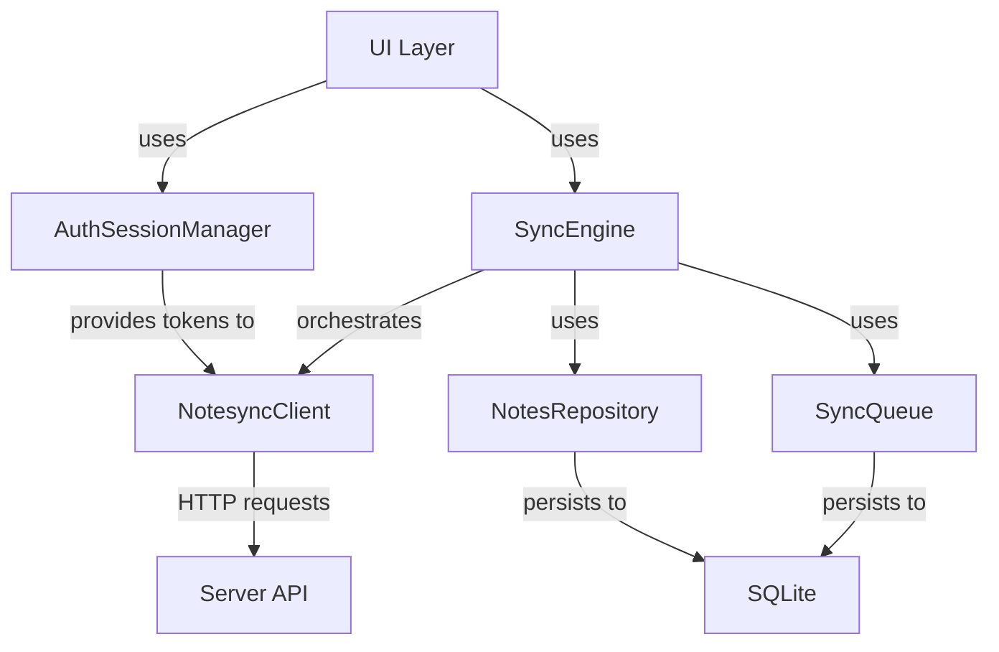

# Phase 2: Sync Features - Implementation Walkthrough

Phase 2 sync implementation is complete! The Android app now has full OAuth authentication and cloud sync matching the iOS app's functionality.

## What Was Implemented

### 1. Data Layer Updates

#### Note Model Enhancements
[lib/models/note.dart](file://../lib/models/note.dart)

Added sync-related fields:
- `serverId` - Server-side ID for the note
- `lastSyncedAt` - Timestamp of last successful sync
- `isDirty` - Flag indicating local changes not yet synced

#### Database Migration
[lib/data/database_helper.dart](file://../lib/data/database_helper.dart)

- Migrated database from v1 to v2
- Added sync columns: `serverId`, `lastSyncedAt`, `isDirty`
- Added index for faster dirty note queries
- Automatic migration for existing users

---

### 2. Sync Services

#### AuthSessionManager
[lib/services/auth_session_manager.dart](file://../lib/services/auth_session_manager.dart)

OAuth authentication manager:
- Initiates OAuth flow in external browser
- Handles callback with authorization code
- Exchanges code for access + refresh tokens
- Stores tokens securely using `flutter_secure_storage`
- Auto-refreshes expired tokens
- Provides authentication state via `ChangeNotifier`

#### NotesyncClient  
[lib/services/notesync_client.dart](file://../lib/services/notesync_client.dart)

HTTP API client for sync operations:
- `sendSync()` - Push note changes to server
- `fetchLatestNotes()` - Pull notes from server
- Automatic token refresh on 401 errors
- Request/response serialization matching iOS API format
- Error handling and retry logic

#### SyncQueue
[lib/services/sync_queue.dart](file://../lib/services/sync_queue.dart)

Persistent offline queue:
- SQLite-backed queue for pending sync operations
- Survives app restarts
- Retry count tracking
- Automatic cleanup of failed items after max retries

#### SyncEngine
[lib/services/sync_engine.dart](file://../lib/services/sync_engine.dart)

Sync orchestrator (most complex component):
- **Push** - Uploads dirty (modified) notes to server
- **Pull** - Downloads latest notes from server
- **Conflict Resolution** - Server wins by default (configurable)
- **Offline Support** - Queues changes when offline
- **Periodic Sync** - Background sync every 15 minutes
- **Progress Tracking** - Reports sync progress 0-100%
- **Full Resync** - Clear local data and restore from server

---

### 3. Configuration

#### Sync Config
[lib/config/sync_config.dart](file://../lib/config/sync_config.dart)

Configuration matching iOS implementation:
- Base URL: `https://zzuse.duckdns.org`
- OAuth start URL with `client=android` parameter
- API endpoints: `/api/notesync`, `/api/notes`
- Callback: `com.zzuse.timeline://auth/callback`
- **TODO**: Replace `'replace-me'` with actual API key

#### OAuth Callback URL Schemes

Both iOS and Android use **Custom URL Schemes** (not Universal Links/App Links):

| Platform | Custom URL Scheme | OAuth Start Param |
|----------|-------------------|-------------------|
| iOS | `zzuse.timeline://auth/callback` | `client=ios` |
| Android | `com.zzuse.timeline://auth/callback` | `client=android` |

**Why Custom URL Schemes instead of Universal Links/App Links?**

| Feature | Custom URL Scheme | Universal Links (iOS) / App Links (Android) |
|---------|------------------|---------------------------------------------|
| Format | `myapp://path` | `https://yourdomain.com/path` |
| Domain verification | ❌ No | ✅ Yes |
| Apple Developer Account | ❌ No | ✅ Yes (for iOS) |
| Server config needed | ❌ No | ✅ Yes (`.well-known/assetlinks.json`) |

The iOS app uses Custom URL Schemes because it avoids the Apple Developer Program requirement. Android follows the same pattern for consistency.

**Server-side handling:**
The server uses the `client` parameter to determine which callback URL to redirect to after OAuth approval:
- `client=ios` → redirects to `zzuse.timeline://auth/callback?code=xxx`
- `client=android` → redirects to `com.zzuse.timeline://auth/callback?code=xxx`

---

### 4. UI Integration

#### Settings Screen
[lib/ui/screens/settings_screen.dart](file://../lib/ui/screens/settings_screen.dart)

Full sync UI:
- **Account Section**
  - Sign in/out buttons
  - Authentication status display
- **Sync Section**  
  - Sync status with icon (idle/syncing/success/error)
  - Last sync timestamp
  - Manual "Sync Now" button
  - Full resync option with confirmation dialog
- **Real-time Updates** - Uses Provider to watch sync state

#### Main App
[lib/main.dart](file://../lib/main.dart)

Provider setup:
- Initializes all sync services
- Provides services via `MultiProvider`

#### Android Manifest
[android/app/src/main/AndroidManifest.xml](file://../android/app/src/main/AndroidManifest.xml)

- Added `INTERNET` permission
- Added deep link intent filter for OAuth callback:
  - Scheme: `com.zzuse.timeline`
  - Host: `auth`
  - Path: `/callback`

---

## Configuration Required

### 1. Update API Key

Edit [lib/config/sync_config.dart](file://../lib/config/sync_config.dart):

```dart
static const String apiKey = 'YOUR_ACTUAL_API_KEY_HERE';
```

### 2. Install Dependencies

```bash
# Fix Flutter permissions first
sudo chown -R $(whoami) ~/development/flutter

# Install dependencies
flutter pub get
```

---

## Testing Instructions

### 1. Basic Build Test

```bash
flutter run
```

App should build and run successfully on your Android device.

### 2. OAuth Login Flow (Manual Code Entry)

> **Note**: Deep link packages (`app_links`/`uni_links`) have Gradle compatibility issues, so OAuth uses manual code entry as a workaround.

1. Open app → Settings → Tap "Sign In"
2. Dialog appears with instructions
3. Tap "Open Browser" - browser opens with OAuth page
4. Sign in and approve access
5. **Server displays authorization code** on the page
6. Copy the code
7. Paste code in the app's text field
8. Tap "Submit"
9. Settings should show "Signed In" status ✅

### 3. Sync Test

**Create Note and Sync:**
1. Create a new note with text and image
2. Settings → "Sync Now"
3. Verify sync status shows "Syncing..." then "Synced successfully"
4. Check server to confirm note was uploaded

**Pull from Server:**
1. Create note on another device (iOS app)
2. Android app → Settings → "Sync Now"  
3. Return to timeline → Note from other device should appear

**Conflict Resolution:**
1. Edit same note on two devices while offline
2. Go online and sync both
3. Server version should win (last-write-wins)

**Offline Queue:**
1. Disable network on device
2. Create/edit notes
3. Settings → Note "Sync Now" is disabled
4. Enable network → Sync automatically triggers
5. All offline changes should sync

### 4. Full Resync Test

1. Settings → "Full Resync"
2. Confirm dialog
3. All local notes deleted and re-downloaded from server

---

## Architecture Overview



**Flow:**
1. User creates/edits note → Repository marks as dirty
2. SyncEngine periodically pushes dirty notes via NotesyncClient
3. Server processes and returns updated note
4. Repository updates note with serverId and clears dirty flag
5. SyncEngine also pulls new notes from server periodically

---

## Known Limitations

1. **Media Sync Not Implemented** - Images and audio are not synced yet (iOS also doesn't sync media in current implementation based on empty `media` arrays in API)
2. **No Batch Size Limiting** - Should split large syncs to stay under 10MB limit  
3. **Error Recovery** - Failed syncs show error but don't provide detailed user guidance

---

## Next Steps

- [ ] Test end-to-end sync flow with actual server
- [ ] Add media (images/audio) sync support
- [ ] Implement batch size limiting for large syncs
- [ ] Add sync conflict UI (currently server always wins)
- [ ] Add sync activity log in settings
