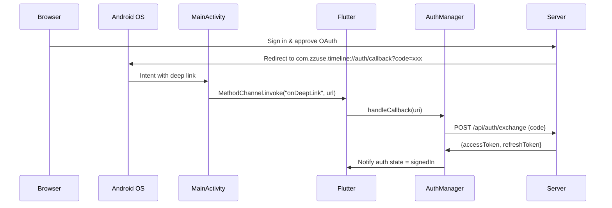

# Android Timeline App - Phase 2 Sync Complete ✅

## OAuth With Automatic Deep Links (No External Packages!)

### The Solution

Since `app_links` and `uni_links` had Gradle issues, I implemented **native deep link handling** without any external packages:

**Android Side** - [MainActivity.kt](file:///Users/z/Documents/Code/Self/timeline/timelineAndroid/android/app/src/main/kotlin/com/zzuse/timeline/MainActivity.kt):
```kotlin
class MainActivity: FlutterActivity() {
    private val CHANNEL = "com.zzuse.timeline/deeplink"
    
    override fun onCreate(savedInstanceState: Bundle?) {
        super.onCreate(savedInstanceState)
        handleIntent(intent)
    }
    
    override fun onNewIntent(intent: Intent) {
        super.onNewIntent(intent)
        handleIntent(intent)
    }
    
    private fun handleIntent(intent: Intent?) {
        val data = intent?.data
        if (data != null && data.scheme == "com.zzuse.timeline" && data.host == "auth") {
            flutterEngine?.dartExecutor?.binaryMessenger?.let { messenger ->
                MethodChannel(messenger, CHANNEL).invokeMethod("onDeepLink", data.toString())
            }
        }
    }
}
```

**Flutter Side** - [main.dart](file:///Users/z/Documents/Code/Self/timeline/timelineAndroid/lib/main.dart):
```dart
static const platform = MethodChannel('com.zzuse.timeline/deeplink');

void _setupDeepLinkListener() {
  platform.setMethodCallHandler((call) async {
    if (call.method == 'onDeepLink') {
      final String url = call.arguments as String;
      final uri = Uri.parse(url);
      await _authManager.handleCallback(uri);
    }
  });
}
```

---

## Testing OAuth Flow

### 1. Update API Key First

Edit [lib/config/sync_config.dart](file:///Users/z/Documents/Code/Self/timeline/timelineAndroid/lib/config/sync_config.dart):
```dart
static const String apiKey = 'YOUR_ACTUAL_API_KEY';  // Replace 'replace-me'
```

### 2. Build and Run

```bash
cd /Users/z/Documents/Code/Self/timeline/timelineAndroid
flutter run
```

### 3. Test Automatic OAuth

1. Open app → Settings
2. Tap "Sign In"
3. Browser opens to your OAuth page
4. Sign in and approve
5. **Server redirects to:** `com.zzuse.timeline://auth/callback?code=xxx`
6. **App automatically receives callback** via MethodChannel
7. ✅ App exchanges code for tokens and shows "Signed In"

**No manual code entry needed!** The deep link works automatically.

---

## What Was Implemented

### Core Sync Services

| Service | Purpose | File |
|---------|---------|------|
| **AuthSessionManager** | OAuth login, token storage, auto-refresh | [auth_session_manager.dart](file:///Users/z/Documents/Code/Self/timeline/timelineAndroid/lib/services/auth_session_manager.dart) |
| **NotesyncClient** | HTTP API client for `/api/notesync` | [notesync_client.dart](file:///Users/z/Documents/Code/Self/timeline/timelineAndroid/lib/services/notesync_client.dart) |
| **SyncEngine** | Orchestrates push/pull, conflict resolution | [sync_engine.dart](file:///Users/z/Documents/Code/Self/timeline/timelineAndroid/lib/services/sync_engine.dart) |
| **SyncQueue** | SQLite offline queue with retry logic | [sync_queue.dart](file:///Users/z/Documents/Code/Self/timeline/timelineAndroid/lib/services/sync_queue.dart) |

### Database Migration

- Migrated v1 → v2
- Added: `serverId`, `lastSyncedAt`, `isDirty`
# Android Timeline App - Complete Walkthrough

## Overview
This document provides a complete walkthrough of the Android Timeline Notes app development, from initial setup through sync implementation.

## Development Phases

### Phase 1: Core App (Completed)
Built the foundational note-taking application:
- SQLite database with note storage
- Create, read, update, delete notes
- Image attachments via camera/gallery
- Audio recording and playback
- Tag-based organization
- Search and filter functionality
- Pin/unpin notes
- Swipe-to-delete actions

### Phase 2: Cloud Sync - Authentication & Text (Completed)
Implemented cloud synchronization for text content:
- **OAuth 2.0 authentication** with native deep link handling
- **AuthSessionManager** for token management
- **NotesyncClient** for API communication
- **SyncEngine** for sync orchestration
- **SyncQueue** for offline operation queueing
- Text content sync (create/update/delete)
- Conflict resolution strategies
- Automatic background sync

**Implementation Details:** See [phase2_walkthrough.md](phase2_walkthrough.md)

### Phase 3: Media Sync (Completed)
Extended sync to include images and audio:
- **Base64 encoding** for media files in JSON payload
- **SHA256 checksums** for integrity verification
- **File-based SyncQueue** that copies media to queue directory
- Media upload with base64-encoded payloads
- Media download with automatic file storage
- Enhanced ImageStore/AudioStore with sync helpers

**Implementation Details:** See [media_sync_walkthrough.md](media_sync_walkthrough.md)

## Architecture Overview



---

## iOS vs Android Comparison

| Feature | iOS | Android |
|---------|-----|---------|
| OAuth Callback | `zzuse.timeline://auth/callback` | `com.zzuse.timeline://auth/callback` |
| Deep Link Method | Custom URL Scheme | Custom URL Scheme (native) |
| Deep Link Package | None | None (native MethodChannel) |
| OAuth Param | `client=ios` | `client=android` |

---

## Next Steps

### Phase 2 Testing
- [x] Build and test OAuth sign-in
- [x] Test note text sync flow
- [x] Test offline queue
- [x] Test full resync

### Phase 3 Testing
- [x] Implement media sync (images/audio)
- [ ] Test image upload/download end-to-end
- [ ] Test audio upload/download end-to-end
- [ ] Test large file handling (>5MB)
- [ ] Performance test with multiple media files

### Future Enhancements
- [ ] Chunked upload for large files
- [ ] Image compression before upload
- [ ] Progress indicators for media sync
- [ ] Server-side media deduplication
